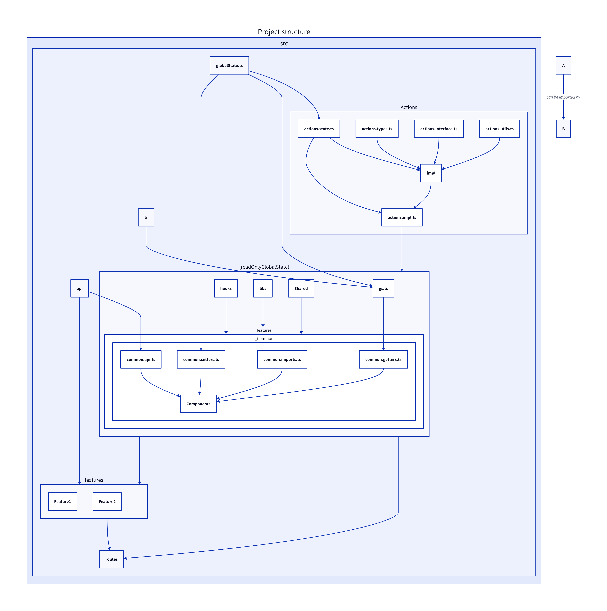

# Client

This is the client side of the application.

# Development

## Requirements

- [bun](https://bun.sh/)
- [typedoc](https://typedoc.org/)
- [serve](https://www.npmjs.com/package/serve)
- [playwright](https://playwright.dev/) + ([VsCode extension](https://marketplace.visualstudio.com/items?itemName=ms-playwright.playwright))

## Installation

```sh
bun install
```

## Run

```sh
bun run dev
```

## Build

Build and preview in development mode with:

```sh
bun run build
bun run preview
```

Build and preview in production mode with:

```sh
bun run buildProd
bun run previewProd
```

## Deploy

Build and deploy in production mode with:

```sh
bun run buildDeploy
```

Generate the static html files with (already done by `buildDeploy`):

```sh
bun run genHtml
```

## Test

Execute tests with:

```sh
bun run test
```

Execute tests coverage with:

```sh
bun run cov
```

Execute tests in ui with:

```sh
bun run testui
```

Execute test codegen with:

```sh
bun run codegen
```

## Documentation

```sh
bun run doc
```

## Dependency graph

```sh
bun run depgraph
```

You can visually check that the [Project structure](#project-structure) is respected.

## Lint

Get the linting report with:

```sh
bun run lint
```

Fix the linting issues with:

```sh
bun run lintfix
```

## GenAPI

Generate the api with:

```sh
bun run genApi
```

Edit the file [\_genApi.ts](./_genApi.ts) if you want to change the api generation.

TODO: capacitor

# Project structure



- `(readOnlyGlobalState)` is not a folder.
- All components placed in a folder that start with `_` are common components.

## Enable api mock

To enable the api mock, it is recommended to add `enableApiMock()` in the `src/index.ts` file.

## Configure the UI preview

You can configure the UI preview by calling the `configurePreview` function in the `src/index.ts` file.  
When the UI preview is enabled, the components implemented with the `withPreview` HOC will render the preview UI instead of the real UI.
If the `configurePreview` function is called with the `dynamic` preview type, it will returns an object that can be used to dynamically switch between the real UI and the preview UI.

```jsx
const bPreview = configurePreview("dynamic", false);

const Main = () => {
	const [isPreview, setIsPreview] = useState(false);
	bPreview.useEffect((setPreview) => setPreview(isPreview), [isPreview]);

	return <Checkbox checked={isPreview} onChange={() => setIsPreview(!isPreview)} />;
};
```
