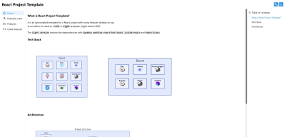
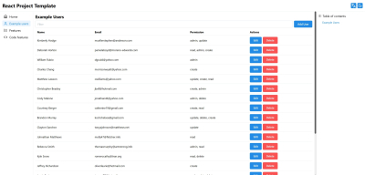
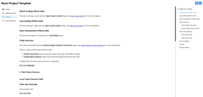
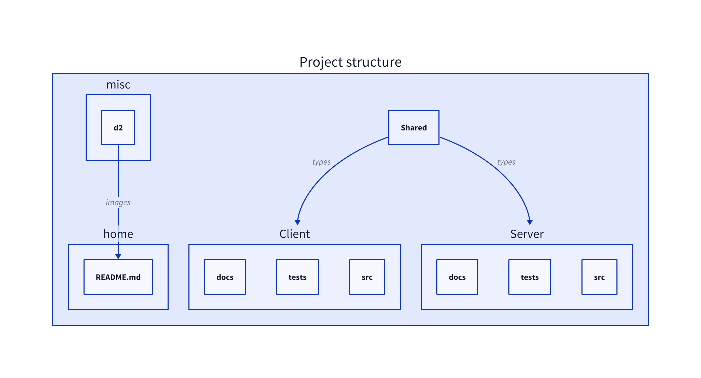
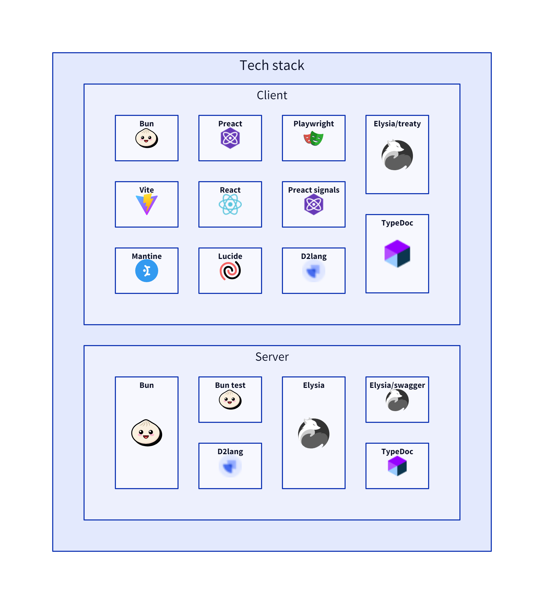

# React Project Template

This is an opinionated template for a React project with many features already set up.  
There are 2 links, each link corresponding to `React` `Full`/`Light` Template. _(The `Light` version is WIP)_

[](./misc/home_screenshot.jpeg)
[](./misc/users_screenshot.jpeg)
[](./misc/features_screenshot.jpeg)

### [Try it online](https://nicolasventer.github.io/Preact-Project-Template/)

The `Light version` remove the dependencies with `typebox`, `mantine`, `react-hot-toast`, `lucide-react` and `react-icons`.

## Links

- [React Full Template](https://github.com/nicolasventer/React-Project-Template/tree/full)
- [React Light Template](https://github.com/nicolasventer/React-Project-Template/tree/light)

## Features

- [x] File base routing (client) (using [Easy-React-Router](https://github.com/nicolasventer/Easy-React-Router))
- [x] Lazy loading (client) (using [Easy-React-Router](https://github.com/nicolasventer/Easy-React-Router))
- [x] Auto memoization (client)
- [x] Structured code (server and client)
- [x] Tests (server and client)
- [x] Code coverage (server and client)
- [x] Documentation (client) _(WIP: add of Storybook on client, and see for Server)_
- [x] Ready for Native (client)
- [x] Dependency graph (server and client)
- [x] Linting (server and client)
- [x] API type safety (server and client)

## Installation

### Requirements

```sh
npm install -g bun
npm install -g serve
```

### On Windows:

#### Installation

```bat
git clone https://github.com/nicolasventer/Preact-Project-Template
cd Preact-Project-Template
all_init_on_cloned.bat
```

The script will create a symbolic link between the `Shared` folder of the `Client` and `Server` folders and then install the dependencies.  
If you want to install the dependencies manually, you should at least create the symbolic link:

```bat
mk_link.bat
```

If you only require the server, you can run the following:

```bat
copy_shared.bat
```

### On Linux

#### Installation

```sh
git clone https://github.com/nicolasventer/React-Project-Template.git
cd React-Project-Template
./all_init_on_cloned.sh
```

The script will create a symbolic link between the `Shared` folder of the `Client` and `Server` folders and then install the dependencies.  
If you want to install the dependencies manually, you should at least create the symbolic link:

```sh
mk_link.sh
```

If you only require the server, you can run the following:

```sh
copy_shared.sh
```

## Usage

### Client

#### Development

##### Watch mode

In the Client folder:

```sh
bun run dev
```

**WARNING:** Be sure to be exactly in the Client folder, otherwise you will have page not found error.

_Access the client at http://localhost:5173_

##### Preview mode

In the Client folder, run:

```sh
bun run build
bun run preview
```

_Access the client at http://localhost:4173_

#### Production

##### Preview mode

In the Client folder, run:

```sh
bun run buildProd
bun run previewProd
```

_Access the client at http://localhost:4173/${clientEnv.BASE_URL}/_

#### Deployment

In the Client folder, run:

```sh
bun run buildDeploy
```

It updates the `docs` folder (for example for GitHub pages).

### Server

#### Development

##### Watch mode

In the Server folder, run:

```sh
bun run dev
```

##### Preview mode

In the Server folder, run:

```sh
bun run start
```

_Check that the server is running at http://localhost:3000/_

#### Production

TODO: see for building the server.

#### Deployment

TODO: see for deploying the server.

---

## Project structure



## Tech stack


