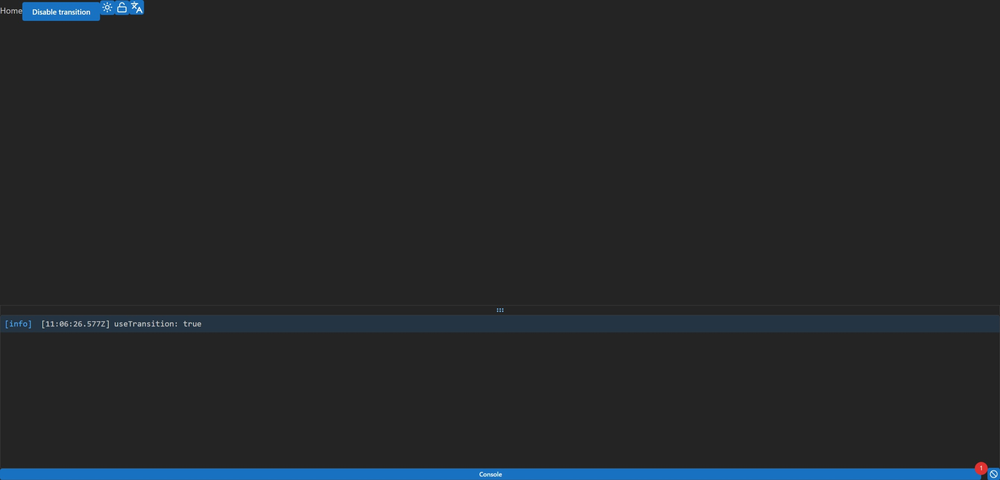
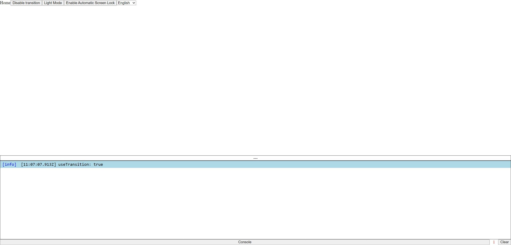

# Preact Project Template Demo

This branch is a demo of the `Preact Project Template`.  
There are 4 links, each link corresponding to `Preact`/`React` `Full`/`Light` Template.

|  |  |
| :---------------------------------------------: | :-----------------------------------------------: |
|                      Full                       |                       Light                       |

The `React versions` are using the custom hook `useReact`. This hook ensure the re-render of the component when the signal is changed.

There is also another custom hook called `useReactSignal`. It is a wrapper around `useState` that returns an object with the property value that is an accessor (get and set) for the state.

**Note:** memo is not used in React version.

**Note 2:** It is expected in the future that **_all Preact versions will be deleted_** since memoization is handled by React with its compiler.

The `Light versions` remove the dependencies with `typebox`, `mantine`, `react-hot-toast`, `lucide-react` and `react-icons`.

## Links

- [Preact Full Template](https://github.com/nicolasventer/Preact-Project-Template/tree/preact/full)
- [Preact Light Template](https://github.com/nicolasventer/Preact-Project-Template/tree/preact/light)
- [React Full Template](https://github.com/nicolasventer/Preact-Project-Template/tree/react/full)
- [React Light Template](https://github.com/nicolasventer/Preact-Project-Template/tree/react/light)
